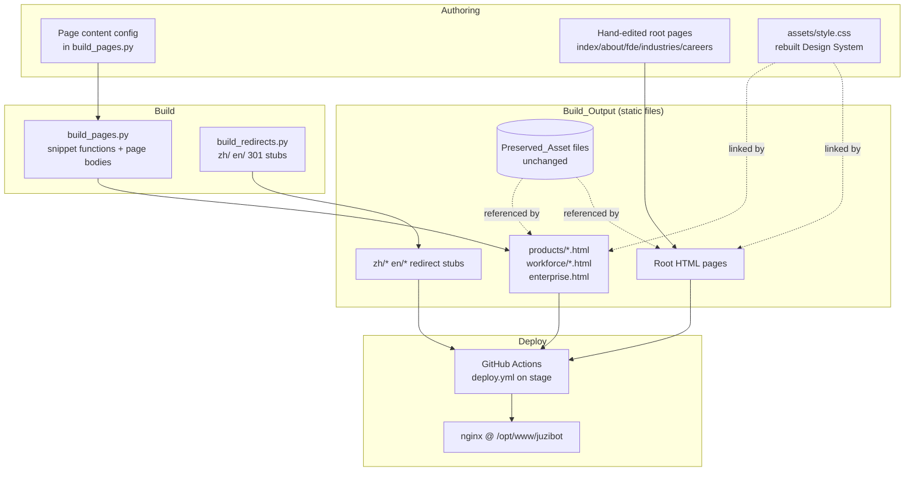
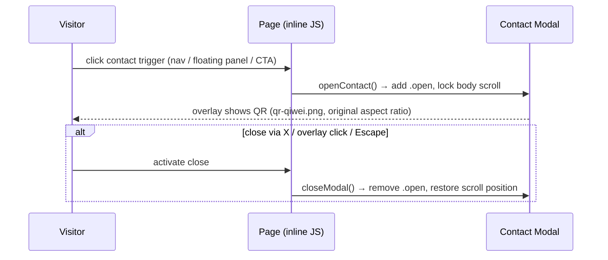

# Design Document

## Overview

This design describes a ground-up frontend rebuild of the JuziBot company website (`juzibot.com` / 句子互动). The redesign replaces the visual design system, information architecture, page layout, and interaction styling of the existing static site, while preserving **100% of the existing content** and reusing **every brand and product asset byte-for-byte**.

The guiding principle from the requirements holds throughout: **preserve content, completely rebuild design; preserve assets, do not preserve the old layout.**

The redesign operates inside the existing reality of the repository, which is non-negotiable infrastructure:

- A **static multi-page site** in Simplified Chinese (`lang="zh-CN"`), served as plain files with no server runtime.
- A **single shared stylesheet** (`assets/style.css`) that all pages link to.
- A **Python build pipeline** (`build_pages.py`) that generates the 7 product pages, the 6 AI-employee pages, and `enterprise.html` from shared snippet functions (`nav_html`, `footer_html`, `cta_band`, `page_layout`, `feat_grid`, `kpi_row`, `split_section`, `block`, `cta_section`).
- **Hand-edited root pages** (`index.html`, `about.html`, `fde.html`, `industries.html`, `careers/index.html`) that coexist with the generated pages and share the same nav/footer/modal markup.
- A **GitHub Actions deploy pipeline** (`.github/workflows/deploy.yml`) that deploys the `stage` branch over SSH and re-runs `build_pages.py` when it changes.
- A **redirect-stub generator** (`build_redirects.py`) producing `zh/*` and `en/*` 301 stubs that point back to the home page.

The core design strategy is therefore: **the redesign is expressed almost entirely through (1) a rewritten `assets/style.css` design-token system and component rules, and (2) rewritten HTML structure in the build pipeline snippets and hand-edited root pages — with zero changes to asset files, content strings, file paths, or deployment configuration.**

### Design Goals

1. Establish an international, modern AI-SaaS visual language (referencing OpenAI / Stripe / Linear / Vercel / Notion AI / Anthropic) on a light, near-white foundation with restrained accent usage.
2. Rebuild every page's DOM module ordering and grid layout so no page reuses its old structure.
3. Transform dense long-form copy into shared, reusable structured components (cards, grids, lists, timelines, tables, FAQ accordions) without dropping a single string.
4. Guarantee content and asset fidelity through automated verification baked into the build pipeline.
5. Keep the site fully static, accessible (WCAG 2.1 AA for body copy), and responsive from 320px to 1920px.
6. Keep the build pipeline as the single source of truth for generated pages and shared components.

### Non-Goals

- No CMS, framework, bundler, or server runtime is introduced (Requirement 9).
- No content is rewritten, summarized, translated, or trimmed (Requirements 2, 5).
- No asset is re-exported, recompressed, or replaced (Requirement 1).
- No deployment infrastructure changes (Requirement 9).

## Architecture

### System Context



### Layering

The redesign is organized into four conceptual layers, all expressed in static files:

| Layer | Responsibility | Where it lives |
|-------|----------------|----------------|
| **Design tokens** | Canonical colors, typography, spacing, radius, shadow, elevation | `:root` in `assets/style.css` |
| **Components** | Reusable visual patterns (nav, footer, cards, grids, buttons, modal, announcement bar, floating panel, tables, accordions, timelines) | Component rules in `assets/style.css` + shared snippet functions in `build_pages.py` |
| **Page composition** | Module order + grid per page, assembled from components | `page_layout` + per-page body builders in `build_pages.py`; hand-edited root pages |
| **Behavior** | Nav dropdowns, mobile burger toggle, contact modal, floating panel scroll reveal, announcement marquee, demo-mockup scaling | Inline vanilla JS (no dependencies), identical logic in generated and root pages |

### Key Architectural Decisions

**AD-1: Rebuild the token system in place rather than introduce a new framework.**
The existing site already centralizes design tokens in the `:root` block of `assets/style.css` (e.g. `--blue`, `--orange`, `--radius`, `--shadow-md`). The redesign replaces the *values and structure* of these tokens and consolidates the sprawling per-color palette (currently blue/orange/green/purple/teal/pink) down to the required maximum of **3 accent tokens** (Requirement 3.4). Keeping a single CSS file honors Requirement 9 (no new infra) and Requirement 10.5 (one shared rule per pattern).

**AD-2: The build pipeline remains the single source of truth for generated pages and shared regions.**
All shared structural regions (nav, footer, contact module, floating panel, announcement bar) are produced by single snippet functions and reused across every generated page (Requirements 8.3, 8.5, 10.5). Root pages embed the *same* markup. To keep root pages and generated pages in lock-step, the shared regions are defined once and the root pages are regenerated/synchronized from the same snippet source where practical.

**AD-3: Asset and content fidelity is enforced by automated verification, not by manual review.**
Because Requirements 1, 2, 5, and 8 demand byte-for-byte asset preservation and 100% content preservation, the design adds a **verification step** (a Python checker, `verify_site.py`, runnable locally and reusable as the project test harness) that compares the redesigned output against a captured baseline of the pre-redesign site. This makes "no string dropped" and "no asset modified" machine-checkable rather than aspirational.

**AD-4: Behavior stays as dependency-free inline JS.**
The interactions (Requirement 7, 11.4) are simple enough to implement in a few inline functions, which keeps every page renderable when opened directly as a file (Requirement 9.2) and avoids any build/bundle step.

## Components and Interfaces

### Design System (`assets/style.css`)

The rebuilt stylesheet is structured top-to-bottom as: token declarations → base/reset → layout primitives → components → page-section rules → responsive overrides → reduced-motion/fallbacks.

**Token contract.** Every visual value used anywhere on the site MUST resolve to a token defined in `:root`. The six required token categories (Requirement 3.1) each define at least one named token:

- **Color**: surface/background, text, border, plus accent tokens.
- **Typography**: font family stack, a type scale (display / h1 / h2 / h3 / body / small), weights, line-heights.
- **Spacing**: a spacing scale (e.g. `--space-1`…`--space-12`) with a minimum content padding token ≥ 16px (Requirement 3.2).
- **Radius**: `--radius-sm`, `--radius`, `--radius-lg`.
- **Shadow**: `--shadow-sm`, `--shadow-md`, `--shadow-lg`.
- **Elevation**: named z-index/elevation tokens (`--elev-nav`, `--elev-float`, `--elev-modal`).

**Accent constraint.** Exactly ≤ 3 accent color tokens (e.g. `--accent`, `--accent-2`, `--accent-3`); all accent usage references only these (Requirement 3.4). Gradients are accent-only and limited to ≤ 30% of any viewport, never a full-section background fill (Requirement 3.3).

**Canonical component tokens.** Exactly one canonical token set governs card styles, button styles, and shadow treatments; no page-local overrides are permitted (Requirement 3.5, 10.1, 10.5).

**Fallbacks.** Every `var(--token)` reference uses a fallback value (`var(--token, <fallback>)`) so an undefined/failed token never yields a browser-default unstyled element (Requirement 3.7).

### Shared Snippet Functions (`build_pages.py`)

These functions are the reusable component library for generated pages. The redesign rewrites their *output markup* (new structure/classes) while keeping their *interfaces* stable so per-page bodies keep working.

| Function | Role | Notes for redesign |
|----------|------|--------------------|
| `nav_html(rel)` | Site navigation incl. both dropdowns, login/contact, burger | Same link set/labels across pages; only `rel` path prefix differs (Req 8.3) |
| `footer_html(rel)` | Footer with product/industry/company columns | Shared, path-prefix-only variance |
| `announcement_html()` | Scrolling marquee bar | Extracted into a single shared snippet (Req 8.5) |
| `contact_module(rel)` | Floating panel + contact modal markup + behavior script | Single shared snippet; QR from Preserved_Asset |
| `page_layout(...)` | Full-page shell (head, meta, nav, hero, body slot, footer, modal) | Emits semantic landmarks (Req 10.4) |
| `feat_grid(items, cols)` | Feature grid component | Shared structured component (Req 5.4) |
| `kpi_row(items)` | Metric/data display row | Shared structured component |
| `split_section(...)` | Two-column text + visual block | Shared structured component |
| `block(...)` | Section wrapper with eyebrow/title/sub + content | Shared structured component |
| `cta_band(...)` / `cta_section(...)` | Call-to-action band | Shared structured component |
| **new** `feature_list(...)`, `comparison_table(...)`, `timeline(...)`, `faq_accordion(...)`, `tag_categories(...)` | Additional structured formats for Requirement 5.1 | Added only if a content block needs them |

**New-component rule (Req 8.5):** any new shared component is exposed as exactly one snippet function and reused; no per-page duplicated markup.

### Navigation System

- **Desktop (≥1024px):** full horizontal nav links visible, burger hidden. Product dropdown (7 links) and AI-employee dropdown (6 links) reveal on hover **and** keyboard focus (Requirements 4.3, 6.3, 11.3).
- **Mobile (320–767px):** burger visible, desktop links hidden; burger toggles `nav-open` class on the `.nav` element to reveal links (Requirements 6.2, 7.7).
- Every dropdown link resolves to its sub-page; all 18 pages reachable within ≤ 2 interactions from home (Requirements 4.2, 4.3).
- Burger, contact triggers, and modal close control each expose a non-empty accessible name (`aria-label`) (Requirement 11.3).

### Interactive Modules



- **Announcement bar:** horizontally scrolling marquee, content duplicated so the loop is seamless and no message is truncated (Requirement 7.1).
- **Floating panel:** hidden while `scrollY ≤ 200px` (also `pointer-events:none`), shown beyond 200px, offering 在线咨询 / 预约演示 / 获取方案 (Requirements 7.4, 7.5).
- **Contact modal:** opens on any contact trigger, shows the QR Preserved_Asset; closes on X, overlay click, or Escape, restoring prior scroll position (Requirements 7.2, 7.3, 11.4).
- **句子秒懂 workflow mockup:** the existing canvas demo is scaled via the existing `fit()` routine to fit its container with no horizontal overflow at all widths (Requirement 7.8).

### Build & Verification Interfaces

- `build_pages.py` — unchanged invocation contract (`python3 build_pages.py`), regenerates all configured pages to current paths; halts and reports on any write failure or content-lookup failure (Requirements 8.1, 8.6, 9.3).
- `build_redirects.py` — unchanged; continues to emit `zh/*` and `en/*` stubs (Requirements 6.6 via 6, 9.4, 9.5).
- `verify_site.py` (new test harness) — compares Build_Output against the captured pre-redesign baseline for content completeness, asset integrity, link resolution, and metadata constraints.

## Data Models

These are not database entities; they are the structured data the build pipeline and verification operate on.

### Page Descriptor

Each generated page is described by data passed to `page_layout`:

```
PageDescriptor {
  path: string                  # target output path, e.g. "products/miaodong.html"
  title: string                 # 1–60 chars, unique across site (Req 10.2, 10.3)
  description: string           # 1–160 chars, unique across site (Req 10.2, 10.3)
  rel: string                   # relative prefix ("" root, "../" for subdirs)
  breadcrumbs: [(label, href?)]
  hero: { kicker, h1, lede, pills[] }
  body: HTML                    # composed from shared structured components
}
```

### Preserved Asset Record

```
PreservedAsset {
  path: string        # repository path, unchanged
  bytes: blob         # byte-for-byte identical to baseline (Req 1.2)
  kind: enum { raster, svg, vector }
  sourceAspectRatio: number   # for raster: width/height of source file (Req 1.3)
}
```

Invariant: the set of `PreservedAsset.path` after redesign equals the set before (Requirement 1.5).

### Preserved Content String

```
PreservedContentString {
  text: string        # exact character sequence (Req 2.2)
  category: enum { heading, body, metric, evidence, product_name, announcement }
}
```

Invariant: every `PreservedContentString.text` present in the baseline site appears in the redesigned site (Requirements 2.1, 2.5, 5.2, 5.3, 8.4).

### Design Token

```
DesignToken {
  name: string             # e.g. "--accent", "--space-4", "--radius"
  category: enum { color, typography, spacing, radius, shadow, elevation }
  value: string
  fallback: string         # used at reference sites (Req 3.7)
}
```

Invariants: each of the 6 categories has ≥ 1 token (Req 3.1); accent-category tokens number ≤ 3 (Req 3.4); card/button/shadow each have exactly one canonical token set (Req 3.5).

### Baseline Snapshot

A captured copy of the pre-redesign site (git tag or archived copy) providing the reference sets of content strings, asset files+checksums, and internal link targets that verification compares against.

### Responsive Breakpoints

```
Breakpoints {
  mobile:  320px – 767px    # burger nav
  tablet:  768px – 1023px
  desktop: ≥ 1024px         # full nav
  testedRange: 320px – 1920px   # no horizontal overflow anywhere (Req 6.1, 6.4)
}
```

## Correctness Properties

*A property is a characteristic or behavior that should hold true across all valid executions of a system — essentially, a formal statement about what the system should do. Properties serve as the bridge between human-readable specifications and machine-verifiable correctness guarantees.*

Although the redesign is primarily a visual rebuild, the build pipeline emits structured HTML whose preservation and structural guarantees are universally quantified — over all pages, all asset references, all preserved content strings, all design tokens, and all viewport widths in the supported range. Those guarantees are property-testable against the Build_Output and a captured baseline snapshot. Purely visual criteria (gradient coverage, "premium feel", continuous marquee animation) are not property-testable and are covered by linting, snapshot, and manual review in the Testing Strategy. The properties below are the consolidated, non-redundant set produced from the prework analysis.

### Property 1: Content preservation

*For any* content string present in the baseline (pre-redesign) site, that exact character sequence (wording, spelling, punctuation, and numeric value unchanged) appears in the redesigned site on the corresponding page.

**Validates: Requirements 2.1, 2.2, 2.3, 5.2, 8.4**

### Property 2: No fabricated copy in preserved blocks

*For any* preserved content block in the redesigned site, every text string it contains exists in the baseline content set — restructuring introduces no text that was not present in the original Preserved_Content.

**Validates: Requirements 5.3**

### Property 3: Asset integrity

*For any* Preserved_Asset, its post-redesign file is byte-for-byte identical to the baseline (equal size and checksum); every asset reference in any page resolves to an existing Preserved_Asset path; and the set of asset paths after the redesign equals the set before.

**Validates: Requirements 1.1, 1.2, 1.4, 1.5**

### Property 4: Aspect-ratio preservation across widths

*For any* raster Preserved_Asset rendered at any viewport width from 320px to 1920px, the displayed aspect ratio equals the source-file aspect ratio within ±1%, and the asset stays within the inner bounds of its layout container (neither stretched nor compressed).

**Validates: Requirements 1.3, 6.5**

### Property 5: No horizontal overflow across widths

*For any* viewport width from 320px to 1920px, and for any page (including the 句子秒懂 workflow mockup), the document body produces no horizontal scrollbar and no element extends beyond the viewport width, with no clipping, truncation, or text overlap.

**Validates: Requirements 6.1, 6.4, 7.8**

### Property 6: Navigation breakpoint visibility

*For any* viewport width in the mobile range (320–767px) the burger menu is shown and the desktop nav links are hidden; *for any* viewport width in the desktop range (≥1024px) the full nav links are shown and the burger is hidden.

**Validates: Requirements 6.2, 6.3**

### Property 7: Dropdown structure and resolution

*For any* page, the product navigation dropdown contains exactly 7 links and the AI-employee dropdown exactly 6 links, and every such link resolves to an existing sub-page.

**Validates: Requirements 4.3, 7.6**

### Property 8: Internal link integrity

*For any* internal link on any page, its target resolves to an existing output page (no internal link yields a missing page / HTTP 404).

**Validates: Requirements 4.5**

### Property 9: Page reachability

*For any* of the 18 site pages, there exists a navigation path from the home page reaching it within at most 2 navigation interactions.

**Validates: Requirements 4.2**

### Property 10: Module order rebuilt

*For any* of the 17 redesigned pages, its ordered sequence of DOM modules differs from the ordered module sequence of its pre-redesign version.

**Validates: Requirements 4.1**

### Property 11: Long-form copy is structured

*For any* preserved content block presented as continuous body text exceeding 60 consecutive words, that block is rendered using at least one structured component (card, list, feature grid, timeline, comparison table, data display, tag category, or FAQ accordion).

**Validates: Requirements 5.1**

### Property 12: Floating-panel scroll threshold

*For any* vertical scroll offset greater than 200px the floating panel is visible and exposes the 在线咨询 / 预约演示 / 获取方案 actions; *for any* offset of 200px or less the floating panel is hidden and does not capture pointer interaction.

**Validates: Requirements 7.4, 7.5**

### Property 13: Component consistency

*For any* shared component type (card, button, shadow treatment, and each shared structured component), every occurrence across the site resolves to the same Design_System class/token set, with no page-local override or duplicated per-page styling.

**Validates: Requirements 3.5, 5.4, 10.1, 10.5**

### Property 14: Image text-alternative correctness

*For any* Preserved_Asset image that conveys information or function, the redesigned markup provides a non-empty text alternative; *for any* purely decorative Preserved_Asset image, the markup exposes an empty text alternative so assistive technology ignores it.

**Validates: Requirements 11.1, 11.2**

### Property 15: Accessible names for controls

*For any* page, the navigation burger menu, each contact trigger, and the modal close control each expose a programmatically determinable, non-empty accessible name.

**Validates: Requirements 11.3**

### Property 16: Page metadata bounds and uniqueness

*For any* page, the document has exactly one title of length 1–60 characters and exactly one meta description of length 1–160 characters; and *for any* two distinct pages, neither their titles nor their descriptions are identical.

**Validates: Requirements 10.2, 10.3**

### Property 17: Semantic landmarks

*For any* page, the markup contains exactly one `main` region and at least one `header`, one `nav`, and one `footer`, and every sectioning element is introduced by an accessible heading.

**Validates: Requirements 10.4**

### Property 18: Document language

*For any* page, the document language attribute is exactly the value `zh-CN`.

**Validates: Requirements 2.4**

### Property 19: Builder produces the full page set

*For any* page in the Page_Builder configuration, executing the builder produces an output file at that page's current target path, with no configured page omitted.

**Validates: Requirements 8.1**

### Property 20: Generated pages reference the rebuilt design system

*For any* generated page, the page links the rebuilt `assets/style.css` and references no superseded stylesheet or layout version.

**Validates: Requirements 8.2**

### Property 21: Shared regions equal modulo path prefix

*For any* generated page, its shared structural regions (navigation, footer, contact module, floating panel) contain the same links, labels, and element structure as the hand-edited root pages after normalizing relative path prefixes for directory depth.

**Validates: Requirements 8.3, 8.5**

### Property 22: Pages render without a server runtime

*For any* page, opening its file directly from the served file structure renders its primary content correctly using only static HTML, CSS, and client-side JavaScript.

**Validates: Requirements 9.2**

### Property 23: Legacy URLs redirect to home

*For any* existing legacy redirect stub under `zh/` or `en/`, requesting it resolves to the home page.

**Validates: Requirements 2.6, 9.4**

### Property 24: Retained ancillary files exist

The redesigned output retains every `zh/` and `en/` redirect stub and the root `robots.txt` and `sitemap.xml` files.

**Validates: Requirements 9.5**

### Property 25: Design-token category coverage

The Design_System defines at least one named token in each of the six categories: color, typography, spacing, corner radius, shadow, and elevation.

**Validates: Requirements 3.1**

### Property 26: Light-theme token values

The primary page background token has a perceived lightness of at least 90%, and the minimum content padding/whitespace token is 16px or greater.

**Validates: Requirements 3.2**

### Property 27: Accent palette limit

*For any* accent color usage in the Design_System, it references one of at most 3 defined accent color tokens, and no more than 3 accent color tokens are defined.

**Validates: Requirements 3.4**

### Property 28: Token fallbacks prevent unstyled rendering

*For any* design-token reference used for a critical visual property, a fallback value is provided so that an undefined or failed token never produces a browser-default unstyled element.

**Validates: Requirements 3.6, 3.7**

### Property 29: Body-copy contrast

*For any* body-copy text/background color combination defined by the Design_System, the contrast ratio is at least 4.5:1 (WCAG 2.1 AA for normal-sized text).

**Validates: Requirements 11.5**

## Error Handling

### Build-time

- **Missing content lookup / write failure (Req 8.6):** `build_pages.py` wraps each page write and content lookup; on failure it raises with the failing page path and reason, halts immediately, and leaves already-written pages intact (no partial overwrite of the rest).
- **Unresolved asset reference (Req 1.6):** `verify_site.py` scans every asset reference; any reference not resolving to an existing Preserved_Asset is reported with its specific path and fails the verification run.
- **Missing content string (Req 2.5):** the content-completeness comparison reports each baseline string absent from the redesigned output, identifying the specific missing string.
- **Broken internal link (Req 4.5):** verification reports each internal href whose target file does not exist.

### Runtime (client)

- **Unresolvable navigation target (Req 4.6):** because the site is static, an internal link to a missing page is prevented at build time by Property 8; as a runtime safety net, the existing nginx never-404 configuration (`deploy/nginx-never-404.conf`) and the `zh/`/`en/` redirect stubs route unknown paths back to a valid page, keeping the rest of the site reachable.
- **Token load failure (Req 3.7):** `var(--token, fallback)` fallbacks guarantee a styled result even if a token is undefined.
- **JavaScript disabled / failed:** content is server-independent static HTML; core content remains readable. Interactive enhancements (modal, floating panel, dropdown reveal on click) degrade gracefully — dropdown links remain reachable as plain anchors, and the marquee falls back to static (non-animated) text.

### Deploy-time

- **Pipeline step failure (Req 9.6):** the deploy job uses `set -e`; any failing step aborts the run and surfaces a failure in the GitHub Actions run. Because publishing happens in place after a successful checkout/build, a failure before completion leaves the previously served site at `/opt/www/juzibot` unchanged.

## Testing Strategy

The redesign mixes property-testable structural/preservation guarantees with non-testable visual concerns. Testing is therefore layered.

### Baseline snapshot

Before redesign work begins, capture a baseline of the current site (git tag `pre-redesign` plus an archived copy) yielding three reference sets: (1) all content strings per page, (2) all asset files with checksums, (3) all internal link targets. The verifier compares Build_Output against this baseline.

### Property-based tests

Property-based testing **is appropriate** for the structural and preservation invariants above, because they are universally quantified over generatable spaces (viewport widths, scroll offsets, the page set, the asset set, the content-string set, token pairs).

- **Library:** use a property-based testing library for the harness language — **Hypothesis** (Python) for the build-output/content/asset/metadata/token properties driven from `verify_site.py`, and **fast-check** (JavaScript, via a headless browser such as Playwright) for the responsive/interaction properties (Properties 4, 5, 6, 12) that require layout measurement. Do not hand-roll property generation.
- **Iterations:** each property test runs a minimum of 100 iterations.
- **Generators:**
  - viewport widths: integers in [320, 1920] (Properties 4, 5, 6).
  - scroll offsets: integers spanning 0…page height, partitioned around the 200px threshold (Property 12).
  - page selection: sampled from the 17–18 site pages (Properties 1, 7–10, 14–22).
  - token pairs: enumerated body text/background combinations (Property 29).
- **Tagging:** each property test is tagged with a comment in the format **Feature: website-redesign, Property {number}: {property_text}** and references the design property it validates.
- **Mapping:** one property-based test per Correctness Property (Properties 1–29). Properties whose space is a fixed finite set (e.g. 9, 16, 24, 25, 26, 27) are still implemented as a single property test quantifying over that set.

### Example-based unit tests

For the interaction behaviors and error paths that are specific scenarios rather than universal properties:

- Contact modal open on each trigger; close via X, overlay click, and Escape, restoring scroll position (Requirements 7.2, 7.3, 11.4).
- Burger toggle round-trip: activate shows links, activate again hides them (Requirement 7.7).
- Announcement bar contains every message string and is duplicated for a seamless loop (Requirement 7.1, message-presence side).
- Builder error handling: inject a write/lookup failure and assert it halts, reports page + reason, and leaves prior pages intact (Requirement 8.6).
- Link target content: activating an internal link reaches a page containing the expected content (Requirement 4.4, content side).

### Integration & smoke tests

- Deploy-script logic: `stage` checkout, conditional `build_pages.py` re-run, publish reachability (Requirements 9.3, 9.6) — 1–2 representative runs, not property tests.
- Static-config smoke: `deploy.yml` unchanged, no server runtime introduced, site remains static multi-page (Requirement 9.1).

### Non-testable visual concerns (manual / lint / snapshot)

- Gradient accent coverage ≤ 30% and not used as full-section fill (Requirement 3.3): stylesheet lint for gradients on full-section background classes + visual review.
- "International, premium, modern" aesthetic and continuous marquee animation feel: manual design review.
- HTML structure snapshot tests guard against accidental regression of generated markup.

### Performance

- Primary content render within 3 seconds at 10 Mbps (Requirement 4.4): measured with a throttled headless-browser timing check on representative pages, reported separately from correctness tests.

### Accessibility

- Automated axe-core pass per page complements Properties 14–18 and 29; full WCAG 2.1 AA conformance additionally requires manual assistive-technology testing and expert review, which automated checks cannot fully replace.
