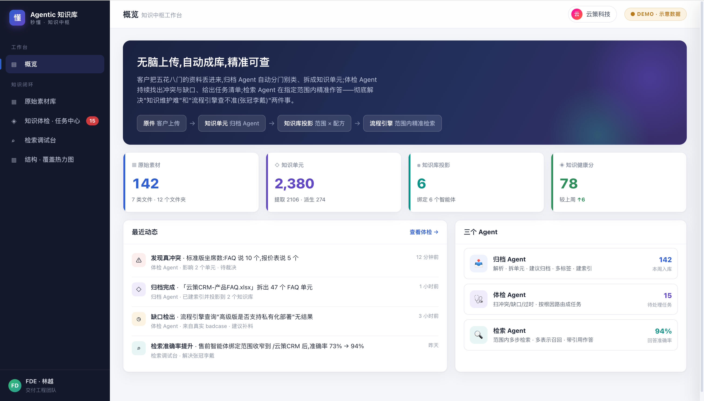

# 产品页真实界面升级（飞书素材高保真示意）+ 站点细节优化

本次提交包含多处 HTML/CSS 调整，并引入 `_feishu/` 下的 PNG/HTML/MP4 作为产品页「真实界面」的高保真示意素材（体积较大）。

多为静态资源与内联样式变更；评审/本地打开/部署后如出现旧样式或旧图，请硬刷新（浏览器会缓存旧资源）。

## 改动一览

| # | 改动 | 截图 |
|---|---|---|
| 1 | `assets/demos/miaohui-workbench.html`：去 Tailwind CDN，改为本地 `miaohui-workbench.css`（便于维护与离线复用） | ✅ |
| 2 | `products/miaodong.html`：按真实功能拆分「流程引擎 / 调优中心 / 模型选择」，并替换为模块化截图 | ✅ |
| 3 | `products/dongxing.html`：新增「真实界面」区块，嵌入可运行的飞书高保真 HTML 示意 + 素材墙，并补充演示视频 | ✅ |
| 4 | `index.html`：顶部导航在小于 1440px 时更紧凑，CTA 不换行；触屏设备隐藏悬浮面板 | — |
| 5 | `products/shouhu.html` / `assets/site.css` / `assets/style.css` / `assets/askbar.js`：细节对齐与资源更新 | — |

## 1. 秒回工作台 demo 本地化（去 CDN）

- 由 `https://cdn.tailwindcss.com` 改为本地 `miaohui-workbench.css`，减少外部依赖，离线可运行。
- Demo 标题与部分布局做了对齐，便于后续作为「轻量高保真示意」嵌入产品页。

截图示例：

## 2. 秒懂页面：真实界面按模块拆分

- 「真实界面」不再用单张综合性截图堆信息密度，而是按真实模块拆分呈现：流程引擎（含转人工）、调优中心、模型选择。
- 相关截图落在 `assets/product-shots/`，页面中按窗口框样式统一陈列。

截图示例：

## 3. 懂行页面：飞书素材高保真示意（可运行 + 视频）

- 新增「真实界面」区块：嵌入 `_feishu/juzi-donghang/句子懂行.html`（iframe，可运行）。
- 同步补充素材墙（PNG）与演示视频（MP4），用于说明「上传素材 → 体检修正 → 范围检索」的闭环。

截图示例（来自 `_feishu/juzi-donghang/`）：

## ⚠️ 资产与验证说明

- `_feishu/` 目录包含多个 MP4（单个最大约 52MB），本次一并提交；如后续需要对外 PR/上游合并，建议再评估素材托管方式与体积控制策略。
- `docs/pr-shots*` 与 `docs/mobile-audit/20260629/` 为评审/验收截图归档，可按需要清理或迁移。

