# 「动态」信息聚合板块——博客、公众号、行业动态汇成一条流

> 预览环境：stage-2 · 新增 5 个文件 + 6 个既有文件小改（净增 16 行）· 三个版式并行试验中

> **2026-07-21 大修**：①三版收敛为两版——列表版 B 的二级分类、最近更新侧卡、展开收起并入聚合版，`news-b.html` 删除；②数据管线加 **AI 筛选层**（本机 claude CLI 批量判定，结果持久化）：博客只上与公司相关的文章（动态页不再强化创始人，110 篇留 37 篇），行业源只留 AI 相关内容（92 条留 45 条，股市快讯等噪音出局）；③行业源从 36氪一路扩到 **36氪 / 量子位 / 钛媒体** 三路，媒体名做二级分类；④顺手修了 `fde.html` 的字号与中文标题断行；⑤合并继承了 PR #92 的 FDE 页与 7 个 AI 员工页视觉升级（人物海报 hero + 卡片体系对齐首页），并按佳芮在 #92 的评论把 FDE 译名统一为「前线部署工程师」（fde.html + 首页）。

> **2026-07-22 信源体系扩展（对标奇绩创坛「齐思」后的裁决：抄它的加工层，不抄它的信源面——官网动态页拼一方内容，不拼覆盖）**：⑥行业源加**关键词预过滤**，恒指收涨类纯行情快讯不进 LLM 直接掐掉；⑦新增两路一方内容登记位——**产品动态**（`data/product-news.json`，发版上新登记一条即合流，结构化产品事实是 AI 引擎最爱引用的 GEO 素材）与**媒体报道/播客**（`data/press-news.json`，存量补录+新增登记）；⑧**AI 锐评**：行业条目各配一句句子互动视角短评（克制口吻，两版渲染为蓝色引言条），性质从转载聚合变编辑评论——齐思评论区我们不抄，每条的「问句子」按钮直接进对话，是它没有的交互；⑨新增**企微生态**源：直抓企业微信开发者中心更新日志（客户全在企微生态里，接口变更是真信息，几乎没有官网做这件事）。至此 6 路信源：博客精选 37 / 公众号 0（等运营过闸）/ 产品动态 0（登记位就绪）/ 媒体报道 0（登记位就绪）/ 行业动态 66 / 企微生态 10，上站 113 条。下文一、二节的三版结构与旧来源名保留作历史记录，最新截图见文末「大修实拍」。

**为什么做**：官网一直缺一个"活"的板块——页面都是静态介绍，访客看不到这家公司每天在想什么、做什么。这个板块把三路内容自动汇成一条按时间排的流：创始人李佳芮在写的（rui.juzi.bot 专栏 110+ 篇）、公众号在发的、行业在发生的（36氪）。每条都能点去原文，也能按住 ⌘K 直接拿这条内容"问句子"。

## 一、三个版式并行，看完选一个定稿

同一份数据，三种排法（页面之间互带切换入口，方便对比）：

| 版本 | 页面 | 排法 | 定位 |
|---|---|---|---|
| A 卡片流 | `news.html` | 双列卡片 | **已接入全站导航「动态」**，搜索引擎只收录这一个 |
| B 列表流 | `news-b.html` | 知乎式双栏：左列表 + 右侧栏（最近更新、数据源） | 未进导航，noindex |
| C 聚合流 | `news-c.html` | 齐思式：按月分组的紧凑流 + 数据源面板 | 未进导航，noindex |

A 版（卡片流，导航入口）：

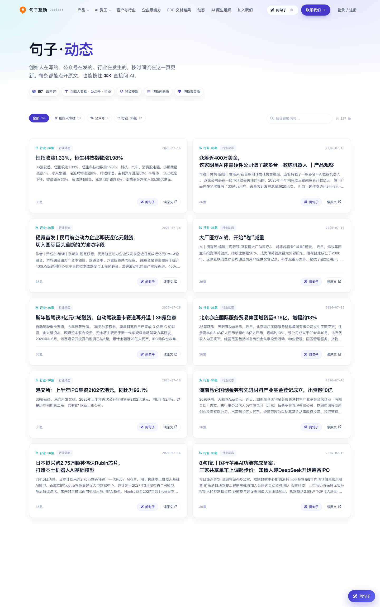

B 版（知乎式列表 + 侧栏）：

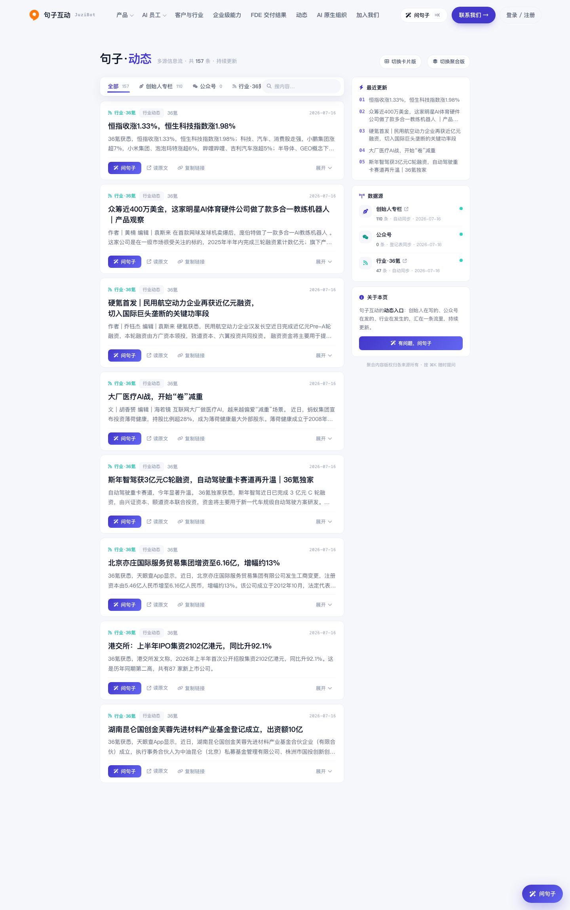

C 版（齐思式聚合，按月分组）：

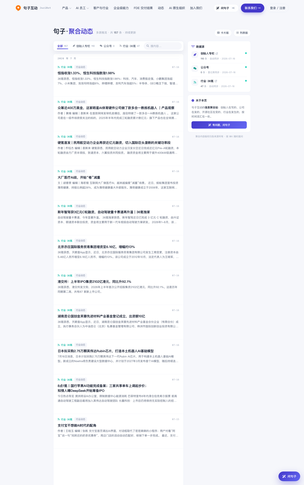

三页共用一套交互约定：顶部按**来源**筛选（创始人专栏 / 公众号 / 行业·36氪）；选中单一来源且它分类多于一种时，才浮出第二排分类筛选——平时不占地方。每条带彩色来源徽章，三页同色同图标。

## 二、内容从哪来，怎么更新

数据管线是仓库根目录的 `build_news.py`，**一条命令抓全部信源并重写三个页面**（增量，可安全反复跑，这点和不能跑的 build_pages.py 不同）：

- **创始人专栏**：读 rui.juzi.bot 的 sitemap，逐篇抓标题、摘要、日期，全自动；
- **公众号**（三个号：句子互动官方 / AI对话未来 / 佳芮的创业笔记）：微信不开放拉取历史文章的接口，所以走"发布登记"——运营发完文，把正式链接贴进飞书多维表格《官网动态发布登记》并勾上「上官网」，管线只拉勾过的行，标题摘要自动补齐。没勾的永远不上站，这张表就是闸门；
- **行业动态**：36氪 RSS 订阅源，全自动。

抓完落到 `data/news.json`，并只重写页面里三个标记区块（预渲染列表、内联数据、总数），页面其余部分照常手工维护。目前 157 条。**尚未配定时任务**，数据是部署时的快照；后续加 launchd/Actions 定时即可全自动。

## 三、站内接入点

- 导航和页脚加「动态」入口，共五处（`site.js` 的注入模板 + 首页/招聘页的内联副本）；
- 问句子（askbar）认识这个板块了：问"最近在做什么/佳芮的文章"会答一段并推「句子·动态」卡片；每条内容的「问句子」按钮会把该条标题带进对话上下文；
- `sitemap.xml` 收录 A 版；`CLAUDE.md` 补了维护说明（哪些能改、哪些是生成区块）。

首页导航（「动态」在 FDE 交付结果之后）：

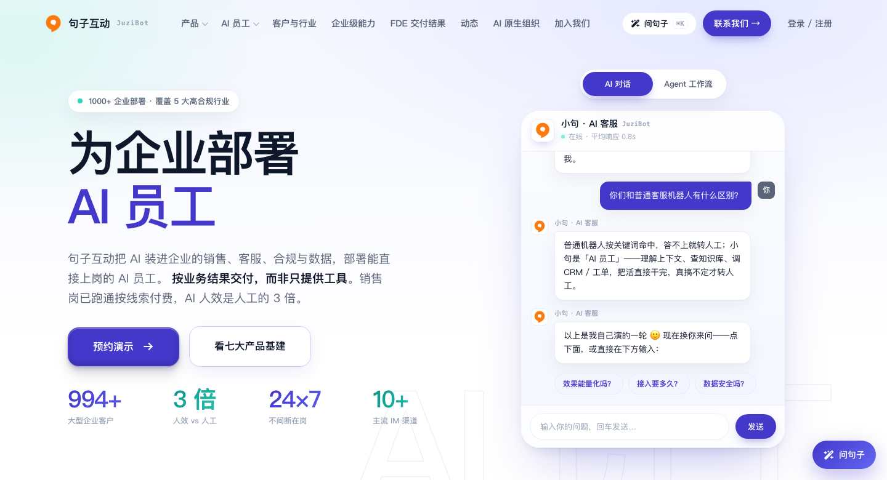

## 四、顺手修掉的三个手机端毛病

移植时用 390px 宽（iPhone 尺寸）逐页实测，发现三个此前没暴露的排版问题，都已修复：

1. **标题撑破卡片**：卡片标题原样式禁止在中文词中间换行（`word-break:keep-all`，为了词不被拆开好看），但遇到一长串没有标点的标题就整行不折、把卡片顶出屏幕。修法：保留原偏好，另加"实在放不下允许任意断字"的兜底（`overflow-wrap:anywhere`）。
2. **窄屏整列被筛选条顶宽**：B/C 版窄屏栅格宽度写法有漏洞（`1fr` 少包了层 `minmax(0,…)`），筛选标签一多，整列被顶到 580px，右边一截被裁掉看不见。
3. **侧栏该藏没藏**：B/C 版写了"窄屏隐藏侧栏"的规则，但它排在侧栏基础样式前面，按 CSS 同权重后者生效的规则被覆盖了，等于没写。已调整声明顺序并加注释防回归。

修复后三页在 390px 下精确收口（A 版 / C 版实拍）：

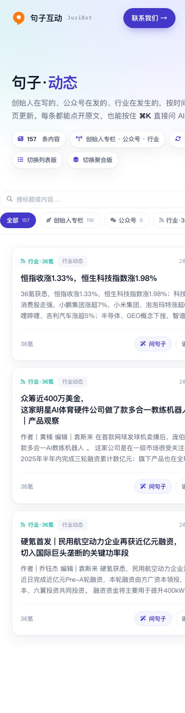

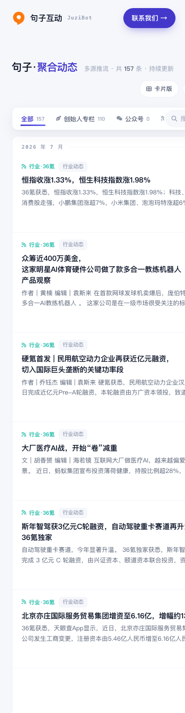

---

## 五、2026-07-21 大修实拍

卡片版（6 路信源、AI 筛选后上站 113 条；行业条目带句子视角的蓝色锐评条；聚合版是唯一切换入口）：

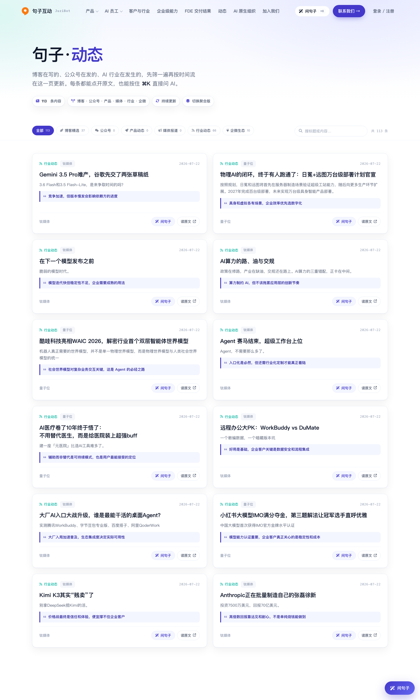

聚合版（并入 B 版能力后：二级分类、最近更新侧卡、展开收起；数据源面板 6 路——手动登记位灰点标识、AI 筛源带「AI 筛」标记、企微生态带官方外链）：

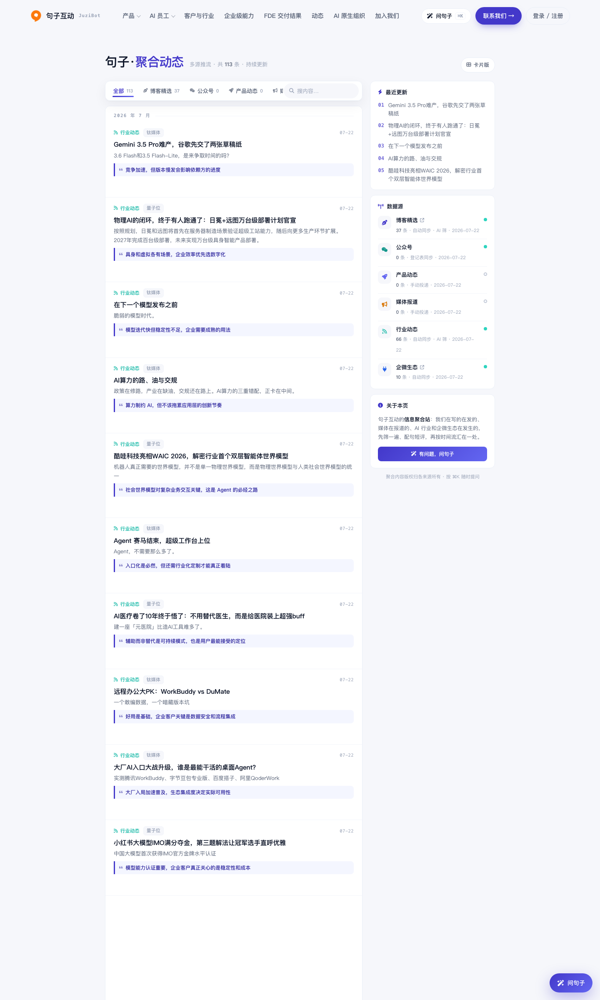

fde.html 排版修复前（hero 断出「的」字开头的行，「FDE 是什么」标题跌回浏览器默认 24px）→ 修复后（断行落在语义边界，小节标题与全页节奏统一；已叠加 PR #92 的视觉升级与「前线部署工程师」译名）：

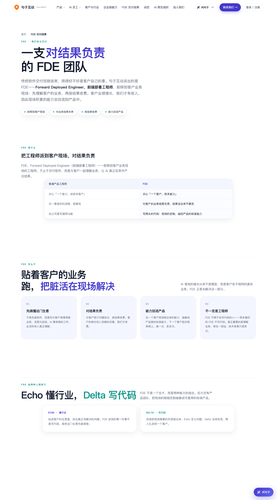

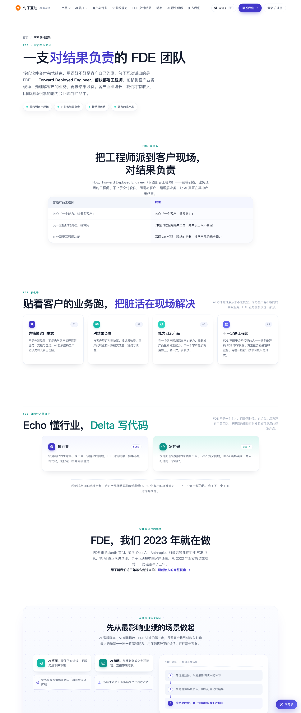

390px 手机端（iframe 精确视口实拍，无溢出）：

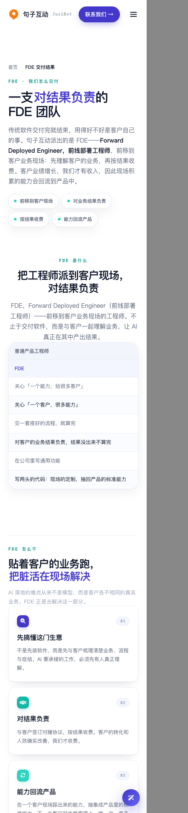

---

截图由无头浏览器对本分支代码实拍（1440px 桌面 / 390px 移动）。评审如看到旧样式请硬刷新（浏览器缓存）。
