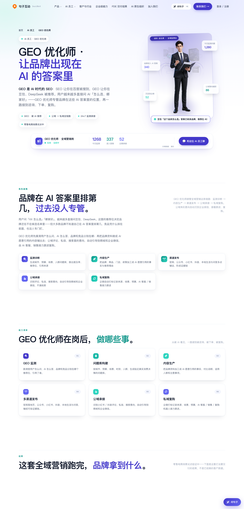
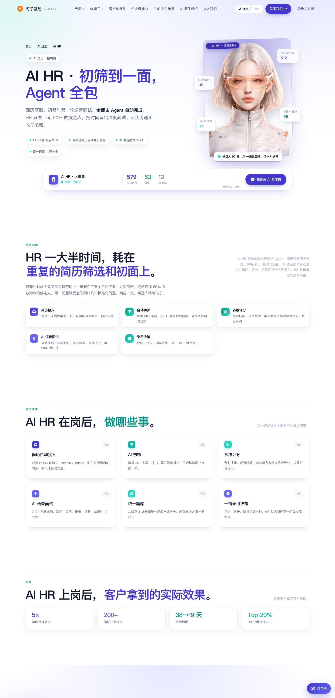
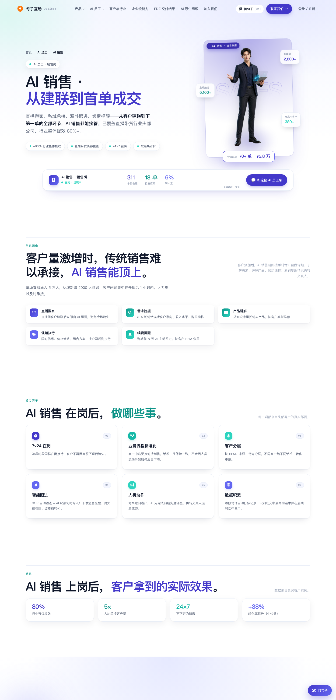
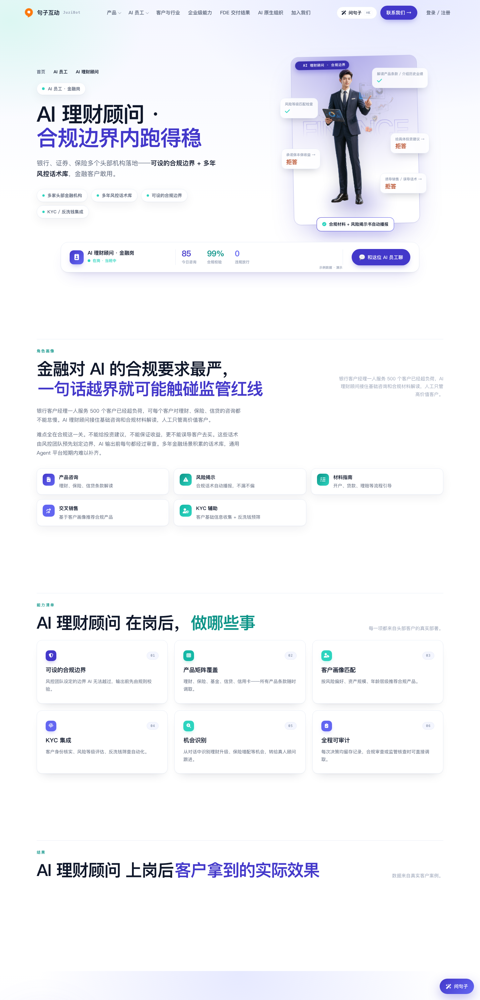
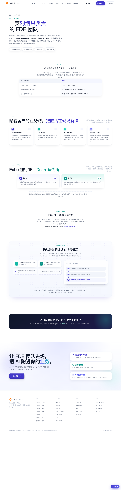
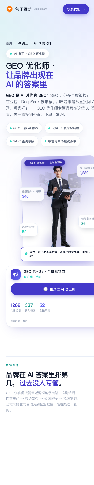

# FDE 页与 7 个 AI 员工页视觉升级——人物海报 hero + 卡片体系对齐首页

> 预览环境：stage-2 · 基于最新 main（a8088c4）· 9 个文件 +850/−397（含 1 张新增海报图）

**为什么改**：AI 员工页 hero 右侧原来是各自为政的数字面板（HR 页是招聘漏斗、金融页是资产面板），和首页「在岗 AI 员工」长廊的人物海报语言对不上；FDE 页的图文长分栏也和首页卡片质感脱节。这次把两处统一到同一套视觉语言。

## 改动一览

| # | 改动 | 截图 |
|---|---|---|
| 1 | workforce 七页：hero 右侧数字面板 → 人物海报舞台（3:4 海报 + 悬浮玻璃数据贴片） | ✅ 下方 |
| 2 | workforce 七页：能力清单卡片对齐 FDE 页质感（白底层叠阴影 + 彩色图标） | ✅ 下方 |
| 3 | workforce 七页：栏目副文小字右对齐；移动端按新版式重写适配 | ✅ 下方 |
| 4 | 新增 GEO 优化师人物海报 `careers/emp-v2-geo-person.png`（此前 GEO 页没有人物图） | ✅ 下方 |
| 5 | fde.html：「从高价值场景切入」重排为场景选择台（双列场景卡，青/橙两色） | ✅ 下方 |
| 6 | fde.html：交付步骤面板改四色卡片组（彩色图标、编号胶囊、悬停左侧彩条） | ✅ 下方 |

## 1. 员工页：人物海报舞台（以 GEO / HR 为例）

第一眼看到的是「一位员工」，业务数据变成悬浮在人物四周的玻璃贴片；GEO 页用的是新增的人物海报图，其余六页复用 `careers/` 已有人物图。

## 2. 员工页：销售 / 金融页同款改造

## 3. FDE 页：场景选择台 + 四色卡片组

## 4. 移动端适配（390px）

海报收窄、贴片字号收缩，窄屏不溢出：

---

截图由无头浏览器对 stage-2 代码实拍（1440px 桌面 / 390px 移动）。评审如看到旧样式请硬刷新（浏览器缓存）。
